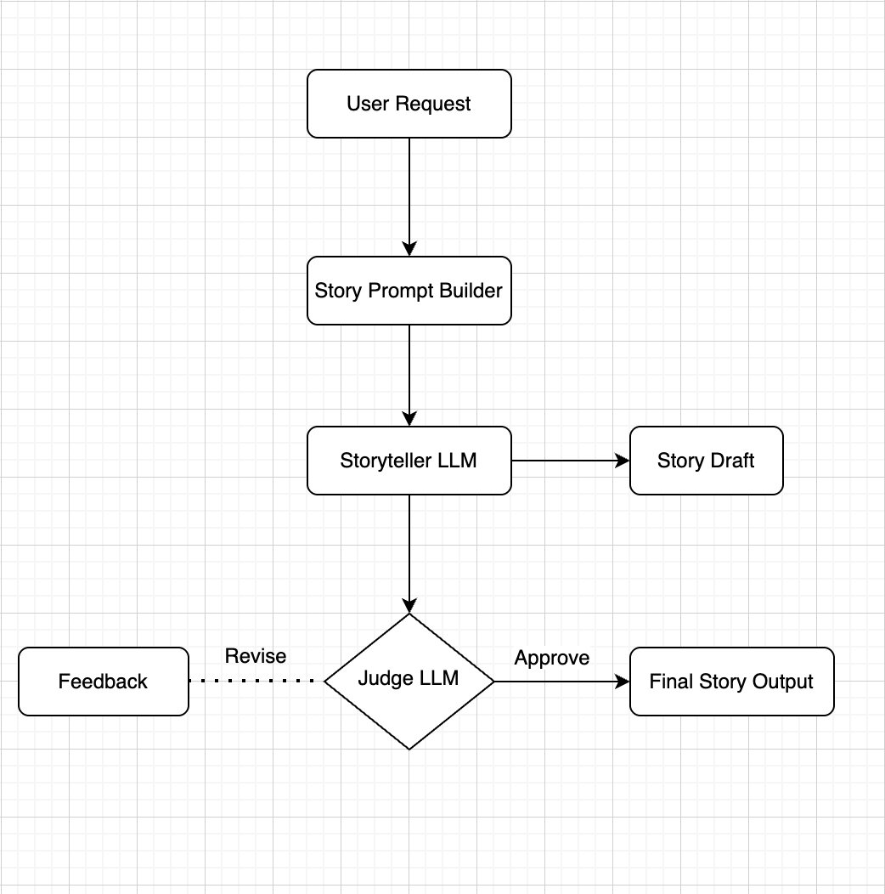
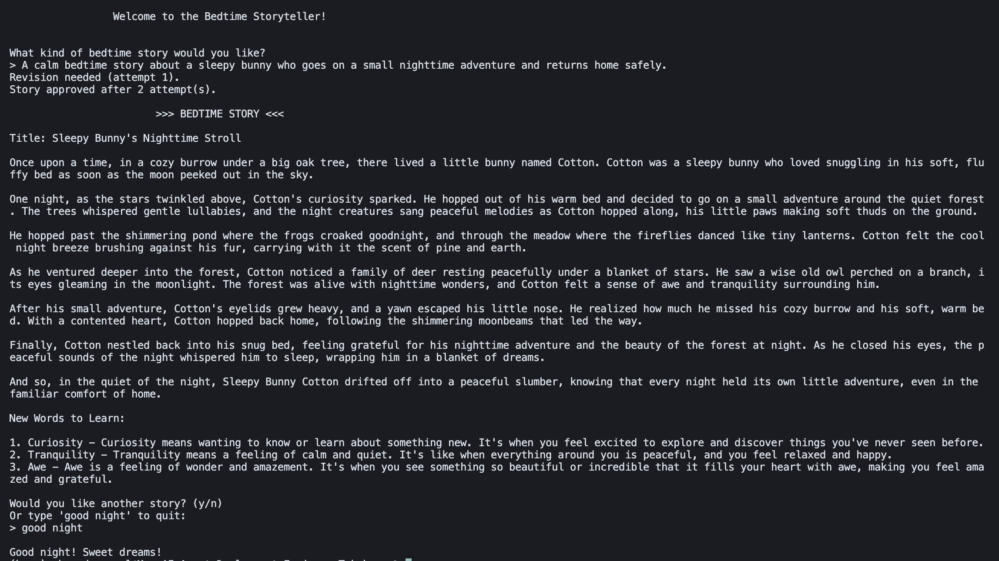

# Bedtime Storyteller 

A Python-based interactive bedtime story generator for children aged 5–10, featuring a storyteller LLM and a judge LLM to ensure age-appropriate, engaging and educational stories.

## Features

- Generates bedtime stories with a clear beginning, middle, and happy ending.
- Adds a short title at the top of every story.
- Includes 3 new vocabulary words with meanings for educational value.
- Judge LLM evaluates the story for age-appropriateness, clarity, engagement, and bedtime suitability.
- Automatic revision loop: if the story is not approved, the storyteller revises it using judge feedback.
- Interactive CLI: ask for multiple stories in a single session.
- Input validation: detects invalid or “garbage” requests and prompts the user to try again.

## File Structure 

| File | Description |
|------|-------------|
| `main.py` | Main interactive CLI loop that orchestrates story generation and revision. |
| `storyteller.py` | Handles story generation with the LLM using structured prompts. |
| `judge.py` | Evaluates story quality based on a rubric and suggests revisions if needed. |
| `prompts.py` | Contains all system and user prompt templates for both storyteller and judge. |
| `requirements.txt` | Lists project dependencies to install with pip. |
| `architecture.png` | Block diagram showing the system flow between user, storyteller, and judge. |
| `output.png` | Screenshot of the output generated from the LLM |
| `.env` | Stores your OpenAI API key (not included in the repo for security). |


## Installation

1. Clone the repository:

```bash
git clone <repo-url>
cd <repo-folder>
```

2. Create and activate a virtual environment
```bash
python -m venv venv
# macOS/Linux
source venv/bin/activate
# Windows
venv\Scripts\activate
```

3. Install dependencies:
```bash
pip install -r requirements.txt
```

4. Add your OpenAI API key to a .env file in the project root

## Run

```bash
python main.py
```

- Enter your story request, e.g. A bedtime story about a friendly dragon.
- The program will generate a story with a title and vocabulary section.
- After the story, you will be asked if you want another story or type "good night" to quit.
- Invalid inputs (e.g. random characters) are rejected with a friendly prompt.

## Next Steps / Improvements
If given 2 more hours, I would:
1. Multi-language Support - Allow stories in different languages with cultural adaptations.
2. Story category detection - Classify user’s request into types such as “animals,” “fantasy,” “friendship,” and use slightly different storyteller prompts for each category to produce more relevant stories.
3. Age Specific Personalization - Ask the user for the child’s age (5–10) and tailor the story accordingly. The storyteller LLM would adjust sentence complexity, vocabulary choice and story content to match the child’s reading level.

## Architecture Diagram


## Output Screenshot

